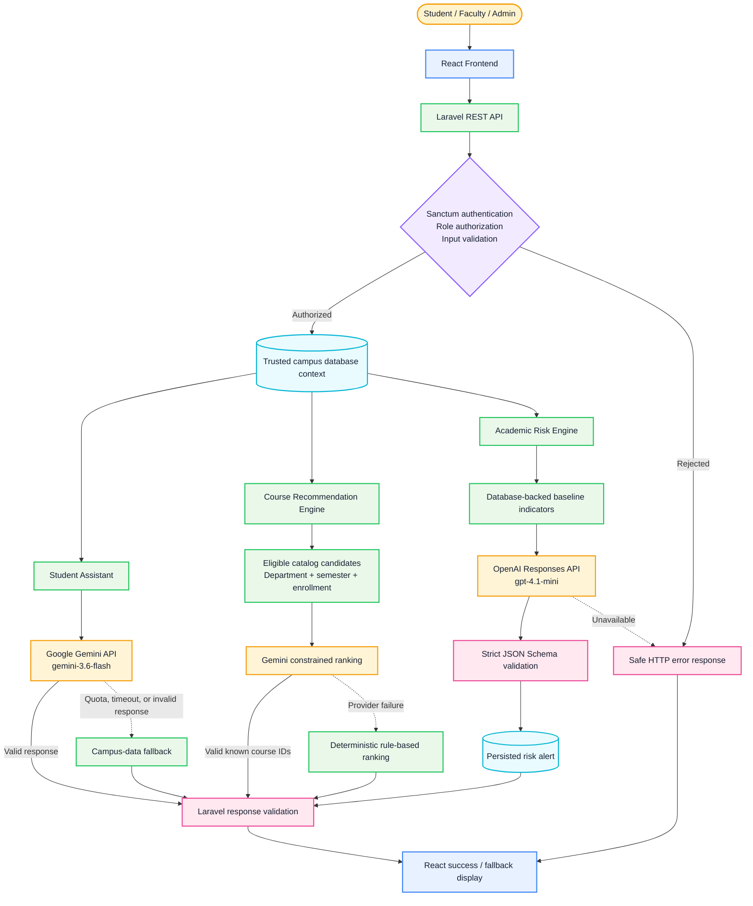

# AI Smart Campus System

An academic management and student-success platform for Northern University of Business and Technology, Khulna (NUBTK). The application combines a React frontend, a Laravel REST API, MySQL, role-based access control, academic monitoring, campus services, and server-side AI integrations.

> Week 08 AI Integration Assignment: this README documents only features verified in the repository source code. AI output is advisory and is not an official academic decision.

## Implemented Features

### Student

- Registration, approval-aware login, password reset, profile, and profile photo
- Student dashboard with courses, attendance, grades, performance, and class schedule
- Academic transcript and attendance export
- Campus tasks, learning resources, notices, and messages
- Campus services including routines, exams, events, fees, support tickets, library loans, leave, and rescheduling
- Student-only AI Assistant
- Personalized course recommendations with a study-plan action

### Faculty

- Faculty dashboard and assigned-course workspace
- Student enrollment, attendance, assessment, grade, and performance entry
- Scoped student monitoring and academic risk indicators
- OpenAI-assisted academic risk analysis for students assigned to the faculty member
- Notice management and permitted campus operations

### Administrator

- User approval and account management
- Department, course, notice, routine, exam, event, fee, and campus-operation management
- Institution-wide academic management and monitoring access
- OpenAI-assisted academic risk analysis

## Week 08 AI Integration

The project contains three AI-assisted workflows implemented through the Laravel backend.

| Workflow | Provider | Default model | Access | Failure behavior |
| --- | --- | --- | --- | --- |
| Student AI Assistant | Google Gemini | `gemini-3.6-flash` | Student only | Returns a built-in campus-data guidance fallback when Gemini is missing, unavailable, rate-limited, or invalid |
| Course recommendation ranking | Google Gemini | `gemini-3.6-flash` | Student view; advisor recommendations remain supported | Falls back to deterministic department, semester, and enrollment-based ranking |
| Academic risk analysis | OpenAI Responses API | `gpt-4.1-mini` | Authorized faculty and administrators | Baseline risk indicators remain visible; the AI action returns a safe provider/configuration error |

The models above are configuration defaults detected in `backend/config/services.php` and the AI services. Deployments may override them with protected environment variables.

### 1. Gemini Student Assistant

`POST /api/ai/assistant` accepts a validated question from an authenticated student. Laravel loads trusted context from the database, including the student's department, program, enrolled courses, attendance percentage, and latest CGPA. The browser does not submit authoritative marks or another student's context.

The Gemini service uses a system instruction, bounded connection/request timeouts, a controlled generation configuration, and backend response extraction. If the provider cannot return a usable answer, `CampusAssistantFallback` provides limited built-in guidance for common study, attendance, progress, improvement, and programming questions.

Example request:

```json
{
  "question": "Create a study plan for this week"
}
```

Example response shape:

```json
{
  "status": true,
  "data": {
    "answer": "...",
    "model": "gemini-3.6-flash"
  }
}
```

Fallback responses use `campus-data-fallback` as the model identifier and include `fallback: true`.

### 2. Gemini-Assisted Course Recommendations

When no advisor-created recommendation exists, the backend builds a candidate list from active courses in the student's resolved department and excludes already enrolled courses. A deterministic score prioritizes the student's current semester. Gemini may reorder only the supplied candidates and must return structured JSON containing known course IDs, scores, and reasons.

The backend validates AI-selected IDs against the candidate list. If Gemini is not configured or returns an error/invalid payload, the deterministic ranking is returned instead of an empty page.

### 3. OpenAI Academic Risk Analysis

`POST /api/faculty/students/{student}/analyze-risk` is limited to faculty and administrators. Faculty access is additionally scoped to students assigned through their courses.

The backend sends permitted academic indicators to the OpenAI Responses API and requests strict JSON Schema output containing:

- risk score from 0 to 100;
- risk level: low, medium, or high;
- a prediction summary;
- one to four contributing reasons; and
- supportive academic advice.

Validated analyses are stored in `risk_alerts` with the provider source, model, and analysis time. The application also calculates database-backed baseline indicators; AI does not change grades, attendance, enrollment, approval status, or disciplinary decisions.

## AI Request Architecture

The following diagram is rendered directly by GitHub and represents the implemented backend-controlled AI flow.



- Solid arrows show the normal request path.
- Dashed arrows show safe provider-failure paths.
- API keys, system prompts, authorization, trusted context, and response validation remain in Laravel; the React application never receives an AI credential.

## AI-Related Source Files

| File | Responsibility |
| --- | --- |
| `backend/app/Http/Controllers/Api/AiAssistantController.php` | Student authorization, question validation, and trusted context assembly |
| `backend/app/Services/GeminiCampusAssistant.php` | Gemini assistant request, prompt, timeout, and response parsing |
| `backend/app/Services/CampusAssistantFallback.php` | Built-in provider-independent student guidance |
| `backend/app/Services/CourseRecommendationService.php` | Candidate selection, deterministic ranking, AI merge, and fallback |
| `backend/app/Services/GeminiCourseRecommender.php` | Gemini structured course ranking request |
| `backend/app/Http/Controllers/Api/RecommendationController.php` | Advisor recommendations and student recommendation delivery |
| `backend/app/Services/OpenAiRiskAnalyzer.php` | OpenAI Responses API request and strict risk-analysis schema |
| `backend/app/Http/Controllers/Api/StudentMonitoringController.php` | Access scope, baseline indicators, AI invocation, and risk-alert persistence |
| `frontend/src/pages/AiAssistantPage.jsx` | Student question, loading, answer, and error interface |
| `frontend/src/pages/CourseRecommendationsPage.jsx` | Recommendation cards and study-plan action |
| `frontend/src/pages/StudentMonitoringPage.jsx` | Faculty/admin monitoring and AI analysis interface |
| `backend/tests/Feature/AiAssistantTest.php` | Assistant authorization, validation, provider, and fallback tests |
| `backend/tests/Feature/CourseRecommendationEngineTest.php` | Recommendation ranking, AI constraints, and fallback tests |
| `backend/tests/Feature/StudentMonitoringTest.php` | Monitoring authorization, OpenAI structure, and persistence tests |

## Environment Configuration

Copy the example environment file and place real credentials only in `backend/.env` or protected deployment secrets. Never commit keys or include them in screenshots.

```dotenv
GEMINI_API_KEY=
GEMINI_MODEL=gemini-3.6-flash
GEMINI_TIMEOUT=30

OPENAI_API_KEY=
OPENAI_MODEL=gpt-4.1-mini
OPENAI_TIMEOUT=30
```

The frontend needs no Gemini or OpenAI key.

## Technology Stack

- Frontend: React 19, React Router, Vite, Bootstrap, Material UI, Axios
- Backend: PHP 8.2+, Laravel 12, Laravel Sanctum
- Database: MySQL by default in the provided environment example
- AI: Google Gemini Generate Content API and OpenAI Responses API
- Testing: PHPUnit, Vitest, Testing Library, and Playwright

## Repository Structure

```text
ai-smart-campus-system/
|-- backend/        Laravel API, models, services, migrations, seeders, and tests
|-- frontend/       React/Vite application and frontend tests
|-- database/       Database backup and recovery notes
|-- documentation/  API, deployment, ER diagram, AI guide, and Postman files
|-- screenshots/    Existing and planned submission evidence
|-- scripts/        Project utility scripts
`-- README.md
```

## Local Setup

### Backend

```powershell
cd backend
Copy-Item .env.example .env
composer install
php artisan key:generate
php artisan migrate
php artisan storage:link
php artisan db:seed
php artisan serve
```

Configure the database values and optional AI credentials in `backend/.env` before starting the API. Keep `APP_DEBUG=false` and use dedicated database credentials in production.

### Frontend

```powershell
cd frontend
npm install
npm run dev
```

## Verification

Backend AI tests mock provider responses and therefore do not require paid API calls.

```powershell
cd backend
php artisan test
```

```powershell
cd frontend
npm test
npm run lint
npm run build
npm run test:e2e
```

## Week 08 Evidence Checklist

Implementation evidence available in source code:

- [x] AI provider integration through the backend
- [x] Protected environment-variable configuration
- [x] Student-facing AI interaction
- [x] Database-backed context supplied by the backend
- [x] Role authorization and input validation
- [x] Provider timeout/error handling
- [x] Gemini assistant fallback and recommendation fallback
- [x] Structured OpenAI output validation
- [x] Persisted AI risk-analysis result
- [x] Mocked automated tests for success and failure paths
- [x] AI architecture and source-code map

Submission evidence still needed:

- [ ] Current AI Assistant page before sending a prompt
- [ ] Successful Gemini prompt and response with no personal data exposed
- [ ] Course recommendations showing whether the source is Gemini or rule-based
- [ ] Faculty/admin student-monitoring page before analysis
- [ ] Successful OpenAI risk-analysis result
- [ ] Safe fallback/error state with credentials and provider details redacted
- [ ] Browser network/API evidence showing successful endpoints without tokens
- [ ] At least one mobile/responsive AI-page capture

The current `screenshots/` directory contains legacy captures, but it does not contain a complete, consistently named Week 08 AI evidence set. Review every image for private student information, email addresses, phone numbers, tokens, and API keys before submission.

## Known Limitations and Recommendations

- AI quality and availability depend on external provider quota, billing, latency, and model availability.
- The student assistant fallback is rule-based guidance, not a general-purpose language model.
- Course prerequisites are not represented as a dedicated prerequisite graph; recommendations use available catalog, department, semester, enrollment, and advisor data.
- Risk analysis is decision support and requires human review; it must not be used as the sole basis for academic or disciplinary action.
- Live-provider integration tests are not part of the normal automated suite; only mocked provider behavior is verified there.
- Standardized, privacy-reviewed Week 08 screenshots are still required.
- Production deployments should disable debug mode, use non-root database credentials, configure HTTPS, protect environment secrets, and monitor/rate-limit provider usage.
- The built-in fallback source contains visible text-encoding artifacts in a small number of punctuation characters; this should be corrected in application code in a separate task.

## Security and Privacy

- Do not commit `backend/.env` or any real provider credential.
- Do not expose API keys in React variables, browser requests, logs, documentation, or screenshots.
- Use test/demo accounts instead of real student records for assignment evidence.
- Rotate a credential immediately if it has ever appeared in Git history or a shared screenshot.
- Treat AI prompts, responses, risk alerts, grades, attendance, email addresses, and student IDs as sensitive academic data.

## Documentation

- [AI integration guide](documentation/AI_INTEGRATION_GUIDE.md)
- [API reference](documentation/API.md)
- [Deployment guide](documentation/DEPLOYMENT.md)
- [ER diagram](documentation/ER_DIAGRAM.md)
- [Postman collection](documentation/postman/CSE4204-8A-T07_APICollection.postman_collection.json)
- [Screenshot checklist](screenshots/README.md)
- [Database backup notes](database/README.md)

## Team

| Role | Name | Student ID |
| --- | --- | --- |
| Team Leader / Database | Md. Nazmus Shakib | 11220320852 |
| AI | Samira Akter Mitu | 11220320858 |
| Frontend | Tanvin Sadik Dhrubo | 11220320860 |
| Backend | Khan Waziur Rahman | 11220320861 |

Course: CSE 4204 Mobile Computing Lab, Section 8A.
