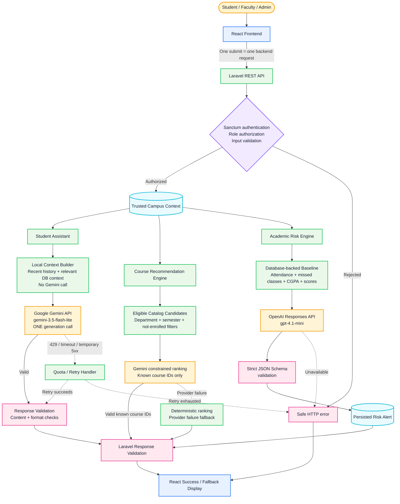

# AI Smart Campus System

An academic management and student-success platform for Northern University of Business and Technology, Khulna (NUBTK). The application combines a React frontend, a Laravel REST API, MySQL, role-based access control, academic monitoring, campus services, and server-side AI integrations.

> Week 08 AI Integration Assignment: this README documents the implemented AI-assisted workflows and the current project configuration. AI output is advisory and is not an official academic decision.

## Implemented Features

### Student

- Registration, approval-aware login, password reset, profile, and profile photo
- Student dashboard with courses, attendance, grades, performance, and class schedule
- Academic transcript and attendance export
- Campus tasks, learning resources, notices, and messages
- Campus services including routines, exams, events, fees, support tickets, library loans, leave, and rescheduling
- Student and faculty conversational AI Assistant, each restricted to their own authorized context
- Personalized course recommendations with a study-plan action

### Faculty

- Faculty dashboard and assigned-course workspace
- Student enrollment, attendance, assessment, grade, and performance entry
- Scoped student monitoring and academic risk indicators
- OpenAI-assisted academic risk analysis for students assigned to the faculty member
- Notice management and permitted campus operations

### Administrator

- User approval and account management
- Department, course, notice, routine, exam, event, fee, and campus-operation management
- Institution-wide academic management and monitoring access
- OpenAI-assisted academic risk analysis

## Week 08 AI Integration

The project contains three AI-assisted workflows implemented through the Laravel backend.

| Workflow | Provider | Default model | Access | Failure behavior |
| --- | --- | --- | --- | --- |
| Campus AI Assistant | Google Gemini | `gemini-3.5-flash-lite` | Student and faculty | Uses server-side retry/quota handling for temporary provider errors and returns a safe user-facing error if the provider remains unavailable |
| Course recommendation ranking | Google Gemini | `gemini-3.5-flash-lite` | Student view; advisor recommendations remain supported | Falls back to deterministic department, semester, and enrollment-based ranking |
| Academic risk analysis | OpenAI Responses API | `gpt-4.1-mini` | Authorized faculty and administrators | Baseline risk indicators remain visible; the AI action returns a safe provider/configuration error |

The models above are configuration defaults. Deployments may override them with protected environment variables.

### 1. Gemini Student Assistant

`POST /api/ai/assistant` accepts a validated question from an authenticated student. Laravel loads only trusted context available for the authenticated account, such as department, program, enrolled courses, attendance, and academic progress. The browser does not submit authoritative marks or another student's trusted context.

The assistant is designed as a natural conversational AI rather than a fixed-response chatbot. It supports English, Bangla, and mixed Bangla-English conversation, recent conversation context, follow-up questions, and general knowledge questions. Campus-specific answers use verified database context and must not invent unavailable academic records.

For a normal successful message, the optimized path uses **one Gemini generation call**. Laravel prepares recent conversation history and relevant database context locally, then sends one complete request to Gemini. It does not use an extra Gemini call just for intent classification, context selection, question rewriting, or conversation summarization.

Temporary provider failures are handled server-side. Existing retry logic respects provider retry information where available and handles temporary errors such as quota/rate-limit, timeout, or selected 5xx failures. If the provider still cannot return a usable answer, the frontend receives a safe error instead of an unrelated hardcoded AI response.

Example request:

```json
{
  "question": "Create a study plan for this week"
}
```

Example response shape:

```json
{
  "status": true,
  "data": {
    "answer": "...",
    "model": "gemini-3.5-flash-lite"
  }
}
```

### 2. Gemini-Assisted Course Recommendations

When no advisor-created recommendation exists, the backend builds a candidate list from active courses in the student's resolved department and excludes already enrolled courses. A deterministic score prioritizes the student's current semester. Gemini may reorder only the supplied candidates and must return structured data containing known course IDs, scores, and reasons.

The backend validates AI-selected IDs against the candidate list. If Gemini is unavailable or returns an invalid result, deterministic ranking remains available instead of returning an empty page.

### 3. OpenAI Academic Risk Analysis

`POST /api/faculty/students/{student}/analyze-risk` is limited to faculty and administrators. Faculty access is additionally scoped to students assigned through their courses.

The backend sends permitted academic indicators to the OpenAI Responses API and requests strict JSON Schema output containing:

- risk score from 0 to 100;
- risk level: low, medium, or high;
- a prediction summary;
- one to four contributing reasons; and
- supportive academic advice.

Validated analyses are stored in `risk_alerts` with the provider source, model, and analysis time. The application also calculates database-backed baseline indicators; AI does not change grades, attendance, enrollment, approval status, or disciplinary decisions.

## AI Request Architecture

The following Mermaid diagram represents the current backend-controlled AI workflow.



- Solid arrows show the normal request path.
- Dashed arrows show temporary-provider or failure paths.
- A normal successful Student Assistant message uses one Gemini generation call.
- API keys, system prompts, authorization, trusted context, retry handling, and response validation remain in Laravel; the React application never receives an AI credential.

## AI-Related Source Files

| File | Responsibility |
| --- | --- |
| `backend/app/Http/Controllers/Api/AiAssistantController.php` | Student authorization, question validation, trusted context assembly, and assistant request flow |
| `backend/app/Services/GeminiCampusAssistant.php` | Gemini request construction, conversational prompt/history, timeout/retry handling, and response parsing |
| `backend/app/Services/CourseRecommendationService.php` | Candidate selection, deterministic ranking, AI merge, and provider fallback |
| `backend/app/Services/GeminiCourseRecommender.php` | Gemini structured course-ranking request |
| `backend/app/Http/Controllers/Api/RecommendationController.php` | Advisor recommendations and student recommendation delivery |
| `backend/app/Services/OpenAiRiskAnalyzer.php` | OpenAI Responses API request and strict risk-analysis schema |
| `backend/app/Http/Controllers/Api/StudentMonitoringController.php` | Access scope, baseline indicators, AI invocation, and risk-alert persistence |
| `frontend/src/pages/AiAssistantPage.jsx` | Student question, loading/thinking state, answer, and safe error interface |
| `frontend/src/pages/CourseRecommendationsPage.jsx` | Recommendation cards and study-plan action |
| `frontend/src/pages/StudentMonitoringPage.jsx` | Faculty/admin monitoring and AI analysis interface |
| `backend/tests/Feature/AiAssistantTest.php` | Assistant authorization, validation, provider, context, rate-limit, and error-path tests |
| `backend/tests/Feature/CourseRecommendationEngineTest.php` | Recommendation ranking, AI constraints, and fallback tests |
| `backend/tests/Feature/StudentMonitoringTest.php` | Monitoring authorization, OpenAI structure, and persistence tests |

## Environment Configuration

Copy the example environment file and place real credentials only in `backend/.env` or protected deployment secrets. Never commit keys or include them in screenshots.

```dotenv
GEMINI_API_KEY=
GEMINI_MODEL=gemini-3.5-flash-lite
GEMINI_TIMEOUT=30

OPENAI_API_KEY=
OPENAI_MODEL=gpt-4.1-mini
OPENAI_TIMEOUT=30
```

The frontend needs no Gemini or OpenAI key.

After changing backend environment values, clear Laravel's cached configuration before testing:

```powershell
cd backend
php artisan optimize:clear
php artisan config:clear
php artisan cache:clear
```

## Technology Stack

- Frontend: React 19, React Router, Vite, Bootstrap, Material UI, Axios
- Backend: PHP 8.2+, Laravel 12, Laravel Sanctum
- Database: MySQL by default in the provided environment example
- AI: Google Gemini Generate Content API and OpenAI Responses API
- Testing: PHPUnit, Vitest, Testing Library, and Playwright

## Repository Structure

```text
ai-smart-campus-system/
|-- backend/        Laravel API, models, services, migrations, seeders, and tests
|-- frontend/       React/Vite application and frontend tests
|-- database/       Database backup and recovery notes
|-- documentation/  API, deployment, ER diagram, AI guide, and Postman files
|-- screenshots/    Existing and planned submission evidence
|-- scripts/        Project utility scripts
`-- README.md
```

## Local Setup

### Backend

```powershell
cd backend
Copy-Item .env.example .env
composer install
php artisan key:generate
php artisan migrate
php artisan storage:link
php artisan db:seed
php artisan serve
```

Configure the database values and AI credentials in `backend/.env` before starting the API. Keep `APP_DEBUG=false` and use dedicated database credentials in production.

### Frontend

```powershell
cd frontend
npm install
npm run dev
```

If Windows PowerShell blocks `npm.ps1` because script execution is disabled, use:

```powershell
npm.cmd run dev
```

## Week 09 Integration Readiness

The project is prepared for an integrated demo without adding unnecessary new features. The expected live flow is:

```text
Register → Admin Approval → Login → Dashboard → Select Feature → Submit Data
→ Laravel validation and authorization → Database Save or server-side AI processing → Display Result
```

### Demo accounts and seed data

The idempotent `CampusDemoSeeder` creates approved demo accounts, CSE courses, enrolments, attendance, grades, routines, notices, and student tasks. The same password is used only for local/demo use:

| Role | Email | Password |
| --- | --- | --- |
| Administrator | `admin@nubtkhulna.ac.bd` | `Demo@12345` |
| Faculty | `faculty.cse@nubtkhulna.ac.bd` | `Demo@12345` |
| Student | `student1@nubtkhulna.ac.bd` | `Demo@12345` |

Seed a fresh local database with:

```powershell
cd backend
php artisan migrate:fresh --seed
```

To demonstrate approval, register a new student or faculty account from the frontend, sign in as the demo administrator, open **Manage Users**, approve the pending account, then sign in with that newly approved account.

### Roles and permissions

- Students use their dashboard, profile, notices, campus services, course recommendations, and the AI Assistant with only their own verified academic context.
- Faculty use their dashboard, assigned-course workspace, student monitoring, notices, campus services, and the AI Assistant with context limited to assigned courses and students.
- Administrators approve accounts and manage users, departments, courses, notices, routines, campus operations, and institution-wide monitoring. Administrators do not have access to the conversational Assistant route.

### Current verification and demo checklist

- [x] Frontend lint and production build pass.
- [x] Frontend unit tests pass (10 tests in the current suite).
- [x] Browser E2E navigation test passes.
- [x] Authentication feature tests pass (13 tests, 71 assertions).
- [x] Campus database-operation and AI feature tests pass (23 tests, 119 assertions).
- [x] Network, timeout, validation, authorization, AI provider, and rate-limit errors have user-facing handling.
- [ ] Run `php artisan test` in CI or a local environment without a command timeout before final submission.
- [ ] Capture current desktop and mobile screenshots using demo accounts only; redact student data and never expose tokens or API keys.
- [ ] Verify configured Gemini/OpenAI credentials in the deployment environment before presenting live AI output.
## Verification

The normal backend automated suite can mock provider responses so tests do not need to consume live provider quota.

```powershell
cd backend
php artisan test
```

```powershell
cd frontend
npm test
npm run lint
npm run build
npm run test:e2e
```

Latest local verification reported for the current Gemini configuration:

- focused AI suite: **15 passed, 71 assertions**;
- full backend suite: **78 passed, 381 assertions**;
- live Gemini messages succeeded with `gemini-3.5-flash-lite`;
- English, Bangla, campus-course lookup, and multi-turn follow-up behavior were tested;
- normal successful-message flow was verified to use one Gemini generation call;
- 429 retry-delay, daily-quota, exponential-backoff, and retry-limit tests passed.

## Week 08 Evidence Checklist

Implementation evidence available in source code:

- [x] AI provider integration through the backend
- [x] Protected environment-variable configuration
- [x] Student-facing conversational AI interaction
- [x] Database-backed context supplied by the backend
- [x] Role authorization and input validation
- [x] One Gemini generation call per normal Student Assistant message
- [x] Provider timeout, quota/rate-limit, retry, and safe error handling
- [x] Deterministic course-recommendation fallback
- [x] Structured OpenAI output validation
- [x] Persisted AI risk-analysis result
- [x] Automated tests for success and failure paths
- [x] AI architecture and source-code map

Submission evidence still needed:

- [ ] Current AI Assistant page before sending a prompt
- [ ] Successful Gemini prompt and response with no personal data exposed
- [ ] Course recommendations showing whether the source is Gemini or rule-based
- [ ] Faculty/admin student-monitoring page before analysis
- [ ] Successful OpenAI risk-analysis result
- [ ] Safe quota/provider error state with credentials and provider details redacted
- [ ] Browser network/API evidence showing successful endpoints without tokens
- [ ] At least one mobile/responsive AI-page capture

Review every screenshot for private student information, email addresses, phone numbers, tokens, and API keys before submission.

## Known Limitations and Recommendations

- AI quality and availability depend on external provider quota, billing, latency, and model availability.
- Free-tier provider limits can temporarily return HTTP `429`; the application handles this safely, but quota itself cannot be bypassed by application code.
- Course prerequisites are not represented as a dedicated prerequisite graph; recommendations use available catalog, department, semester, enrollment, and advisor data.
- Risk analysis is decision support and requires human review; it must not be used as the sole basis for academic or disciplinary action.
- Automated provider tests can use mocked responses; live-provider checks consume real quota and should be used sparingly.
- Standardized, privacy-reviewed Week 08 screenshots are still required.
- Production deployments should disable debug mode, use non-root database credentials, configure HTTPS, protect environment secrets, and monitor/rate-limit provider usage.

## Security and Privacy

- Do not commit `backend/.env` or any real provider credential.
- Do not expose API keys in React variables, browser requests, URLs, logs, documentation, or screenshots.
- Keep Gemini/OpenAI credentials server-side only.
- Redact `key`, `api_key`, `authorization`, and `x-goog-api-key` values from logs and exception output.
- Use test/demo accounts instead of real student records for assignment evidence.
- Rotate a credential immediately if it has ever appeared in Git history, logs, or a shared screenshot.
- Treat AI prompts, responses, risk alerts, grades, attendance, email addresses, and student IDs as sensitive academic data.

## Documentation

- [AI integration guide](documentation/AI_INTEGRATION_GUIDE.md)
- [API reference](documentation/API.md)
- [Deployment guide](documentation/DEPLOYMENT.md)
- [ER diagram](documentation/ER_DIAGRAM.md)
- [Postman collection](documentation/postman/CSE4204-8A-T07_APICollection.postman_collection.json)
- [Screenshot checklist](screenshots/README.md)
- [Database backup notes](database/README.md)

## Team

| Role | Name | Student ID |
| --- | --- | --- |
| Team Leader / Database | Md. Nazmus Shakib | 11220320852 |
| AI | Samira Akter Mitu | 11220320858 |
| Frontend | Tanvin Sadik Dhrubo | 11220320860 |
| Backend | Khan Waziur Rahman | 11220320861 |

Course: CSE 4204 Mobile Computing Lab, Section 8A.

