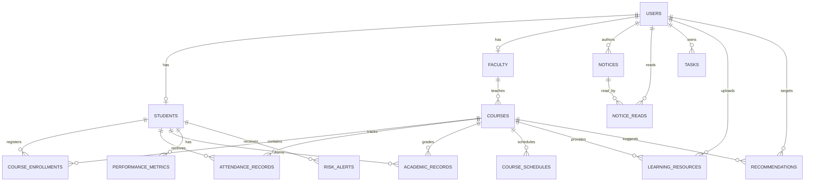

# Entity relationship diagram

This Mermaid diagram reflects the current executable migrations.

Authoritative schema: `backend/database/migrations`. Update this diagram whenever migrations change.
